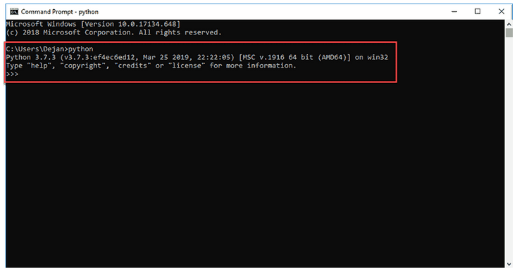
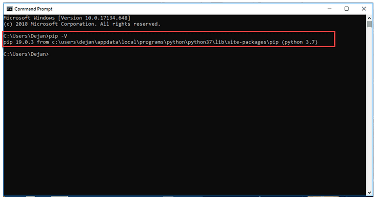
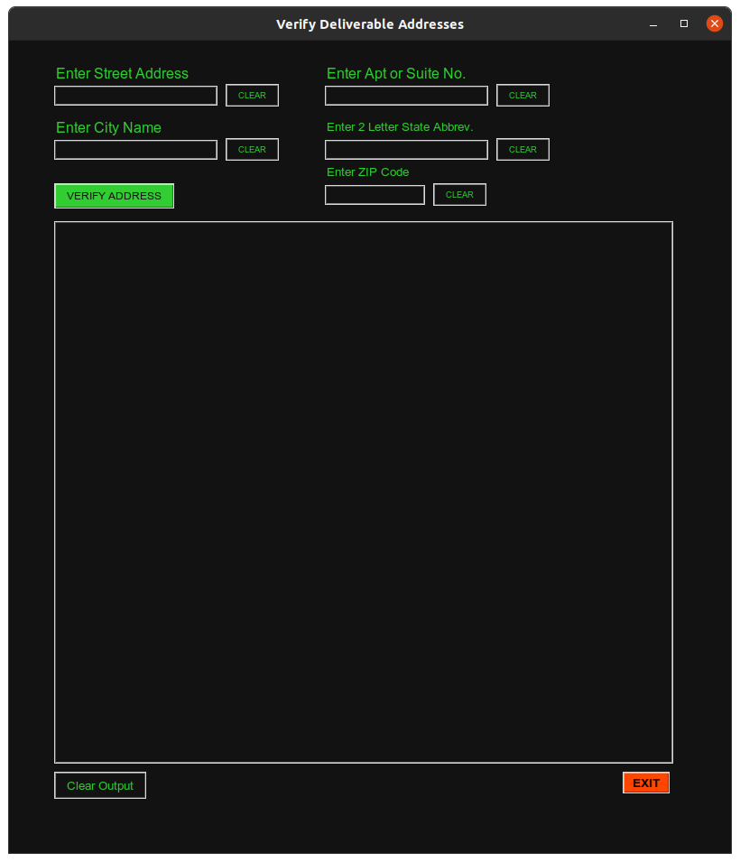

# address.py

## Program name: 

Address Verifier

### Program Creator: 

promontorycoder

### Purpose of Program: 

Verify if an address is deliverable by USPS
________________________________________________________________________________

# REQUIREMENTS AND INSTALLATION FOR UBUNTU 20.04
________________________________________________________________________________

**1. Install python3:**
> sudo apt-get install -y python3
    
**2. Install tkinter:** 
> sudo apt-get install -y python3-tk
    
**3. Install python module 'selenium':**
> python3 -m pip install selenium

**4. Install python module 'webdriver_manager':**
> python3 -m pip install webdriver_manager

**5. Install Firefox web driver:**

> If you have not already installed Firefox Web Browser:

>> sudo apt-get install -y firefox

> Navigate to the following url and download the appropriate geckodriver for 
your linux operating system, either 32 or 64 bit.

>> url: https://github.com/mozilla/geckodriver/releases/tag/v0.29.0
 
> Open gnome-terminal and navigate to the folder containing the downloaded file.

>> Example command: "cd Downloads" 

> Extract downloaded file with the following command:

>> tar -xvzf geckodriver*

> Make the geckodriver executable with the following command:

>> chmod +x geckodriver

> Move the geckodrive file to the correct location with the command below: 

>> sudo mv geckodriver /usr/local/bin/

**6. Acquire Address Verifier program files:**

> Copy files via git clone or other method to chosen install folder

**7. Make program files executable:**
>Open gnome-terminal and navigate to folder with downloaded program files

>Enter the following commands into gnome-terminal:

>> chmod +x address.py

>> chmod +x address.desktop
        
**8. Modify and Copy .desktop file to /usr/share/applications:**

> Open address.desktop in text editor and edit lines 5, 6 and 7 to reflect the 
directory path for your saved files

>> For example:

>>> /home/user/Downloads/Programs/ADDRESS/

>> Save and close address.desktop

> Open gnome-terminal and enter the following command:

>> sudo cp web_insp.desktop /usr/share/applications

**9. Edit address.py for your file path:**

> Right-click on address.py and open in a text editor

> On line 44, modify the variable ff_dwnld_path to reflect the download path on 
your system to the address.py file

>> For example: "/home/user/Downloads/Programs/ADRESS/"

________________________________________________________________________________

# GIT CLONE LINK
________________________________________________________________________________

To git clone into the repository folder, enter the following command into 
Terminal after navigating from within Terminal to the folder you'd like the
program folder to be cloned to.

git clone https://github.com/promontorycoder/address.git
________________________________________________________________________________

# INSTALLATION INSTRUCTIONS FOR WINDOWS 10
________________________________________________________________________________

**1. Install python3:**

> Navigate to the following url and download the appropriate stable release of
'Windows Installer' for your version of Windows, either 32 or 64 bit:

>> https://www.python.org/downloads/windows/

> Once downloaded, run the Python Installer program

>> Make sure to select "Install launcher for all users (recommended)" and "Add
Python (version) to PATH" options

> The next dialog box will allow you to "Disable path length limit". Choose this option to allow Python to bypass the 260 character MAX_PATH limit so that you 
may use long path names if desired (saves some minor headaches later)

> Verify python3 has been correctly installed:

>> Navigate to the directory python3 was installed on the system

>>> Example: C:\Users\username\AppData\Local\Programs\Python\Python38

>> Double-click on python.exe

>> The output should be similar to what you see below:

> Verify python pip was installed:

>> Open the start menu and type "cmd"

>> Select the Command Prompt application

>> Enter the following command into the console:

>>> pip -V

>> Your output should be similar to what you see below:

**2. Install python selenium module:**

> Open the start menu and type "cmd"

>> Select the Command Prompt Application

> Enter the following command into the console:

>> python -m pip install selenium

**3. Install python module webdriver_manager:**

> Open the start menu and type "cmd"

>> Select the Command Prompt Application

> Enter the following command into the console:

>> python -m install webdriver_manager

**4. Install the Firefox web browser:**

> Navigate to the url below:

>> https://www.mozilla.org/en-US/firefox/new/

>> Click the "Download Now" button. The Firefox installer that downloads will
automatically offer you the best available version of Firefox for your computer.

>> When presented with the option, choose "Open file" or "Run"

>>> If you see an *Open File - Security Warning* dialog, click on "Open" or "Run"

>> Wait for Firefox to finish installing. If a dialog box asks you if you want 
to allow this app to make changes to your device, choose "Yes". 

**5. Install firefox web driver (geckodriver):**

> Navigate to the following url and download the appropriate geckodriver for 
your Windows operating system, either 32 or 64 bit.

>> https://github.com/mozilla/geckodriver/releases

> right-click on the downloaded file and extract it

> Note the file path that the extracted file is in. 

>> For example: C:\Downloads

>> in Windows File Explorer, right-click on *"This PC"*

>> Open *"Advanced System Settings"* and click in *"Environment Variables"*

>> Under *"System Variables"*, select *"Path"* and then click on *"Edit"*

>> Click on *"New"* and add the path to the geckodriver.exe file:

>>> In our example above, "C:\Downloads"

>> Click *"OK"* and close all subsequent windows. 

>>> You may need to restart Windows for the new Environment Variable to initialize

**6. Acquire Address Verifier program files:**

> Copy files via git clone or other method to chosen install folder

**7. Edit address.py for your file path:**

> Right-click on address.py and open the file in a text editor, such as 'Notepad'

> On line 44, modify the variable ff_dwnld_path to reflect the download path on 
your system to the address.py file

>> For example: "C:\Downloads\" 

>> Line 44 should read similar to: 

>>> ff_dwnld_path = "C:\Downloads\"

**8. Run address.py:**

> Open the Windows start menu and type "cmd"

>> Select the Command Prompt application

> Navigate to the folder containing addres.py

>> For example: cd C:\Downloads

> Type the following command into the console:

>> python3 address.py

________________________________________________________________________________

